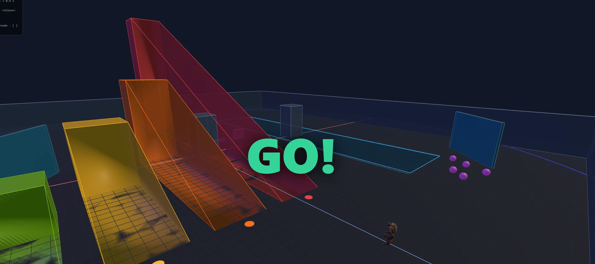

# three-dbox

A physics-driven third-person combat sandbox: charge-and-release abilities, aerial skim-jumps and a
real map with trimesh collision. Built on the `@base` Vue 3 + Three.js game platform
([vue-three-base-packages](https://github.com/komogortev/vue-three-base-packages)).



> **Status:** working prototype. Development is paused while the shared platform packages catch up; the
> project is parked, not abandoned. Health and damage are not implemented yet.

## What it does

- **Movement and abilities** — Rocket Punch (hold/release RMB, 78–152 m/s carry velocity), Rising Uppercut
  (Q), Seismic Slam (hold/release E, mouse-aimed cone with slam AoE), and a skim-jump (Space during a
  punch) that extends the punch into an aerial arc.
- **Collision** — a query-only [Rapier](https://rapier.rs/) world over the map's trimesh, with swept
  anti-tunnelling so a very fast punch cannot pass through a wall. Gameplay movement stays an impulse
  system; Rapier resolves collisions and never simulates the player's dynamics.
- **Round structure** — countdown, play and end screen with a timer overlay.
- **Tooling** — HUD with ability cooldowns, pause / frame-step / slow-motion time control, five NPC
  targets with physics reactions, rebindable input, and a first/third-person camera toggle.

## Run it locally

The app consumes the shared packages through `link:` dependencies, so the two repositories must sit side
by side. Needs Node 20 or newer and pnpm 9 or newer.

```bash
mkdir workspace && cd workspace
git clone https://github.com/komogortev/vue-three-base-packages SHARED
git clone https://github.com/komogortev/three-dbox
cd SHARED && pnpm install && pnpm build    # builds the @base/* packages
cd ../three-dbox && pnpm install && pnpm dev
```

Other scripts: `pnpm build` (type-check and production build) and `pnpm typecheck`.

## Controls

| Input | Action |
|-------|--------|
| WASD | Move (5.5 m/s) |
| Shift | Sprint |
| Space | Jump (or skim-jump during punch) |
| C | Crouch |
| RMB hold/release | Rocket Punch (charge up to 1.4 s) |
| Q | Rising Uppercut |
| E hold/release | Seismic Slam (aim cone, release to fire) |
| Tab | Toggle first / third-person camera |
| P | Pause |
| F | Step one frame |
| [ / ] | Slow down / speed up |

## Roadmap

Next: a health and damage system, ability visual effects and audio, a second character, and the
remaining items in [ROADMAP.md](./ROADMAP.md).

## About this project

three-dbox is a physics and movement calibration project. It uses the feel of late-era Overwatch 1
movement as a reference target for the `@base` platform's input, player and collision packages. It is
not intended to replace or reproduce that game, is not commercial, and is not affiliated with or
endorsed by Blizzard Entertainment. Overwatch and its characters and maps are the property of
Blizzard Entertainment.

## Docs

- [PROJECT.md](./PROJECT.md) — vision and architecture
- [ROADMAP.md](./ROADMAP.md) — alpha roadmap
- [STATE.md](./STATE.md) — current state and known issues
